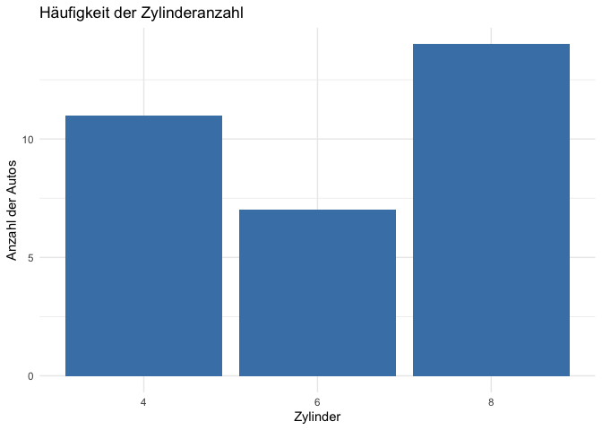
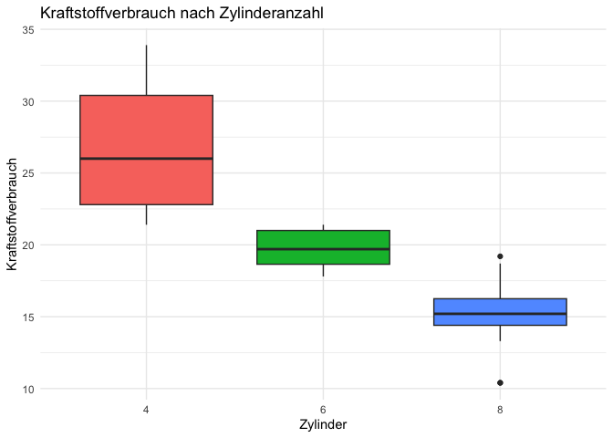
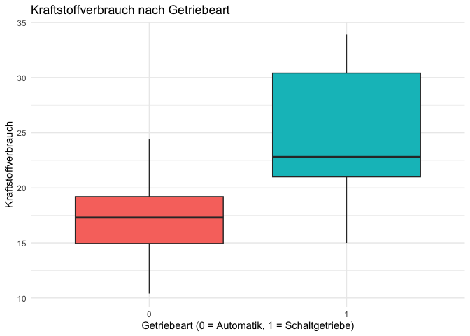
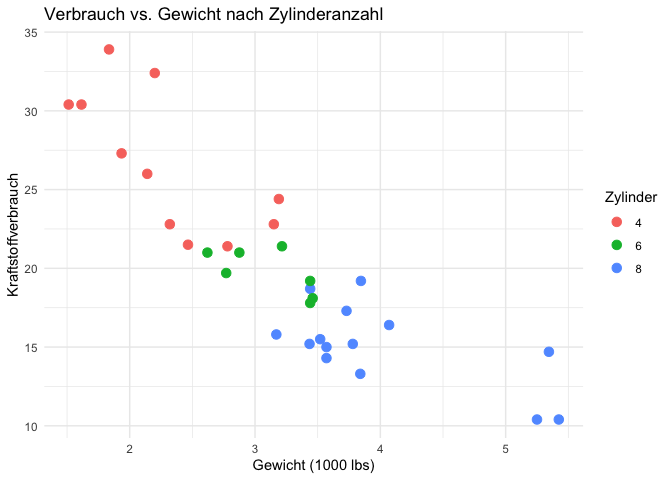
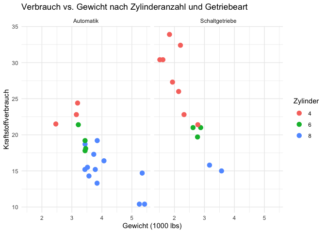
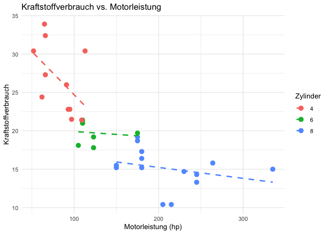
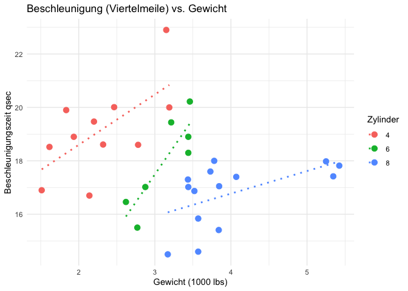
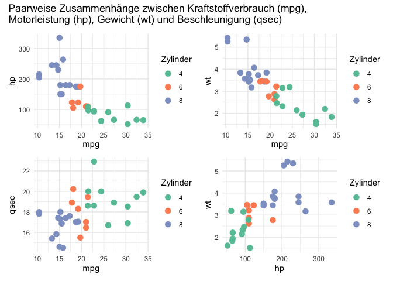
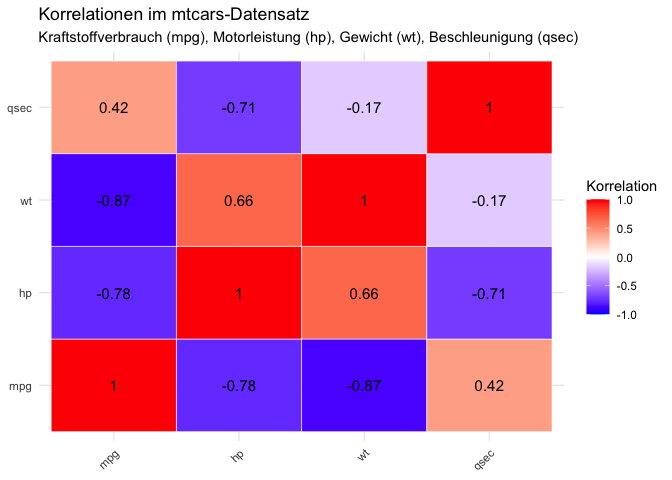

<br> **Beschreibung:** Der Datensatz `mtcars` enthält Daten zu 32 Autos,
u.a. Zylinderanzahl (cyl), Motorleistung (hp), Kraftstoffverbrauch
(mpg), Gewicht (wt), Beschleunigungszeit (qsec) und Getriebeart (am).

In dieser Analyse werden folgende Fragestellungen untersucht:

- Verteilung der Zylinderanzahl  
- Lagemaße (Mittelwert, Median, Modus) und Streuungsmaße (Varianz,
  Standardabweichung, Spannweite, IQR) des Kraftstoffverbrauchs  
- Kreuztabellen zur Beziehung zwischen Zylinderanzahl und Getriebeart  
- Visualisierung der Zylinderverteilung (Balkendiagramm)  
- Boxplot des Kraftstoffverbrauchs nach Zylinderanzahl  
- Boxplot des Kraftstoffverbrauchs nach Getriebeart (Automatik
  vs. Schaltung)  
- Scatterplot von Verbrauch vs. Gewicht, farblich nach Zylinderanzahl  
- Scatterplot von Verbrauch vs. Gewicht facettiert nach Getriebeart  
- Zusammenhang von Verbrauch und Motorleistung  
- Paarweise Zusammenhänge zwischen Kraftstoffverbrauch (mpg),
  Motorleistung (hp), Gewicht (wt) und Beschleunigung (qsec)
- Korrelationsmatrix (Heatmap) mit Kraftstoffverbrauch, Motorleistung,
  Gewicht und Beschleunigung

**Ziel:** Identifikation von Mustern, Zusammenhängen und
Einflussfaktoren auf den Kraftstoffverbrauch, um die Daten explorativ,
statistisch und visuell professionell zu analysieren.  
<br>

#### Bibliotheken

``` r
# Prüfe und installiere benötigte Pakete automatisch
packages <- c("tidyverse", "GGally")

installed <- packages %in% rownames(installed.packages())
if (any(!installed)) {
  install.packages(packages[!installed])
}

# Lade Pakete
library(tidyverse)
```

    ## ── Attaching core tidyverse packages ──────────────────────── tidyverse 2.0.0 ──
    ## ✔ dplyr     1.1.4     ✔ readr     2.1.5
    ## ✔ forcats   1.0.1     ✔ stringr   1.5.2
    ## ✔ ggplot2   4.0.0     ✔ tibble    3.3.0
    ## ✔ lubridate 1.9.4     ✔ tidyr     1.3.1
    ## ✔ purrr     1.1.0     
    ## ── Conflicts ────────────────────────────────────────── tidyverse_conflicts() ──
    ## ✖ dplyr::filter() masks stats::filter()
    ## ✖ dplyr::lag()    masks stats::lag()
    ## ℹ Use the conflicted package (<http://conflicted.r-lib.org/>) to force all conflicts to become errors

``` r
library(GGally)
```

<br>

#### Überblick über den Datensatz

``` r
# Zeige die ersten Zeilen
head(mtcars)
```

    ##                    mpg cyl disp  hp drat    wt  qsec vs am gear carb
    ## Mazda RX4         21.0   6  160 110 3.90 2.620 16.46  0  1    4    4
    ## Mazda RX4 Wag     21.0   6  160 110 3.90 2.875 17.02  0  1    4    4
    ## Datsun 710        22.8   4  108  93 3.85 2.320 18.61  1  1    4    1
    ## Hornet 4 Drive    21.4   6  258 110 3.08 3.215 19.44  1  0    3    1
    ## Hornet Sportabout 18.7   8  360 175 3.15 3.440 17.02  0  0    3    2
    ## Valiant           18.1   6  225 105 2.76 3.460 20.22  1  0    3    1

``` r
# Struktur und Variablen prüfen
str(mtcars)
```

    ## 'data.frame':    32 obs. of  11 variables:
    ##  $ mpg : num  21 21 22.8 21.4 18.7 18.1 14.3 24.4 22.8 19.2 ...
    ##  $ cyl : num  6 6 4 6 8 6 8 4 4 6 ...
    ##  $ disp: num  160 160 108 258 360 ...
    ##  $ hp  : num  110 110 93 110 175 105 245 62 95 123 ...
    ##  $ drat: num  3.9 3.9 3.85 3.08 3.15 2.76 3.21 3.69 3.92 3.92 ...
    ##  $ wt  : num  2.62 2.88 2.32 3.21 3.44 ...
    ##  $ qsec: num  16.5 17 18.6 19.4 17 ...
    ##  $ vs  : num  0 0 1 1 0 1 0 1 1 1 ...
    ##  $ am  : num  1 1 1 0 0 0 0 0 0 0 ...
    ##  $ gear: num  4 4 4 3 3 3 3 4 4 4 ...
    ##  $ carb: num  4 4 1 1 2 1 4 2 2 4 ...

<br>

#### Häufigkeitsverteilungen

``` r
# Häufigkeitstabelle der Zylinderanzahl (Base R)
zylinder_tabelle <- table(mtcars$cyl)
print(zylinder_tabelle)
```

    ## 
    ##  4  6  8 
    ## 11  7 14

``` r
# Relative Häufigkeit in Prozent

prop.table(zylinder_tabelle) * 100
```

    ## 
    ##      4      6      8 
    ## 34.375 21.875 43.750

``` r
# Alternative mit dplyr

mtcars %>% count(cyl) %>% mutate(anteil = n / sum(n) * 100)
```

    ##   cyl  n anteil
    ## 1   4 11 34.375
    ## 2   6  7 21.875
    ## 3   8 14 43.750

<br>

#### Lagemaße des Kraftstoffverbrauchs

``` r
# Mittelwert und Median berechnen (mpg)
mean(mtcars$mpg)
```

    ## [1] 20.09062

``` r
median(mtcars$mpg)
```

    ## [1] 19.2

``` r
# Modus berechnen (häufigster Wert)
modus_tabelle <- table(mtcars$mpg)
names(modus_tabelle)[which.max(modus_tabelle)]
```

    ## [1] "10.4"

<br>

#### Streuungsmaße

``` r
# Varianz
var(mtcars$mpg)
```

    ## [1] 36.3241

``` r
# Standardabweichung
sd(mtcars$mpg)  
```

    ## [1] 6.026948

``` r
# Spannweite (min, max)
range(mtcars$mpg)    
```

    ## [1] 10.4 33.9

``` r
# Spannweite als Differenz
diff(range(mtcars$mpg)) 
```

    ## [1] 23.5

``` r
# Quantile und Interquartilsabstand
quantile(mtcars$mpg)
```

    ##     0%    25%    50%    75%   100% 
    ## 10.400 15.425 19.200 22.800 33.900

``` r
IQR(mtcars$mpg)
```

    ## [1] 7.375

<br>

#### Kreuztabellen

``` r
# Beziehung zwischen Zylinderanzahl und Getriebeart

# Kreuztabelle von Zylindern und Getriebetyp
kreuztabelle <- table(mtcars$cyl, mtcars$am)
print(kreuztabelle)
```

    ##    
    ##      0  1
    ##   4  3  8
    ##   6  4  3
    ##   8 12  2

``` r
# Alternative mit dplyr
mtcars %>% count(cyl, am)
```

    ##   cyl am  n
    ## 1   4  0  3
    ## 2   4  1  8
    ## 3   6  0  4
    ## 4   6  1  3
    ## 5   8  0 12
    ## 6   8  1  2

<br>

#### Visualisierungen

``` r
# Balkendiagramm: Häufigkeit der Zylinderanzahl
ggplot(mtcars, aes(x = factor(cyl))) +
  geom_bar(fill = "steelblue") +
  labs(
    title = "Häufigkeit der Zylinderanzahl",
    x = "Zylinder",
    y = "Anzahl der Autos"
  ) +
  theme_minimal()
```



<br>

``` r
# Boxplot: Kraftstoffverbrauch (mpg) nach Zylinderanzahl
ggplot(mtcars, aes(x = factor(cyl), y = mpg, fill = factor(cyl))) +
  geom_boxplot() +
  labs(
    title = "Kraftstoffverbrauch nach Zylinderanzahl",
    x = "Zylinder",
    y = "Kraftstoffverbrauch"
  ) +
  theme_minimal() +
  theme(legend.position = "none")
```



<br>

``` r
# Boxplot: Kraftstoffverbrauch nach Getriebeart
ggplot(mtcars, aes(x = factor(am), y = mpg, fill = factor(am))) +
  geom_boxplot() +
  labs(
    title = "Kraftstoffverbrauch nach Getriebeart",
    x = "Getriebeart (0 = Automatik, 1 = Schaltgetriebe)",
    y = "Kraftstoffverbrauch"
  ) +
  theme_minimal() +
  theme(legend.position = "none")
```



<br>

``` r
# Scatterplot: mpg vs. Gewicht (wt), farblich nach Zylinder
ggplot(mtcars, aes(x = wt, y = mpg, color = factor(cyl))) +
  geom_point(size = 3) +
  labs(
    title = "Verbrauch vs. Gewicht nach Zylinderanzahl",
    x = "Gewicht (1000 lbs)",
    y = "Kraftstoffverbrauch",
    color = "Zylinder"
  ) + 
  theme_minimal()
```



<br>

``` r
# Scatterplot mit Facetten nach Getriebeart (am)
ggplot(mtcars, aes(x = wt, y = mpg, color = factor(cyl))) +
  geom_point(size = 3) +
  facet_wrap(~ am, labeller = as_labeller(c(`0` = "Automatik", `1` = "Schaltgetriebe"))) +
  labs(
    title = "Verbrauch vs. Gewicht nach Zylinderanzahl und Getriebeart",
    x = "Gewicht (1000 lbs)",
    y = "Kraftstoffverbrauch",
    color = "Zylinder"
  ) +
  theme_minimal()
```



<br>

``` r
# Scatterplot: Motorleistung (hp) vs. Verbrauch (mpg)
ggplot(mtcars, aes(x = hp, y = mpg, color = factor(cyl))) +
  geom_point(size = 3) +
  geom_smooth(method = "lm", se = FALSE, linetype = "dashed") +
  labs(
    title = "Kraftstoffverbrauch vs. Motorleistung",
    x = "Motorleistung (hp)", 
    y = "Kraftstoffverbrauch",
    color = "Zylinder"
  ) +
  theme_minimal()
```

    ## `geom_smooth()` using formula = 'y ~ x'



<br>

``` r
# Gewicht vs. Beschleunigung (Viertelmeile, qsec)
ggplot(mtcars, aes(x = wt, y = qsec, color = factor(cyl))) +
geom_point(size = 3) +
geom_smooth(method = "lm", se = FALSE, linetype = "dotted") +
labs(
title = "Beschleunigung (Viertelmeile) vs. Gewicht",
x = "Gewicht (1000 lbs)",
y = "Beschleunigungszeit qsec",
color = "Zylinder"
) +
theme_minimal()
```

    ## `geom_smooth()` using formula = 'y ~ x'



<br>

``` r
library(ggplot2)
library(dplyr)
library(patchwork)

# mtcars vorbereiten
mtcars2 <- mtcars %>% 
  mutate(cyl = factor(cyl))

# Farben für Zylinder
zylinder_colors <- c("4" = "#66c2a5", "6" = "#fc8d62", "8" = "#8da0cb")

# Einzelplots erstellen
p1 <- ggplot(mtcars2, aes(x=mpg, y=hp, color=cyl)) +
  geom_point(size=3) +
  scale_color_manual(values=zylinder_colors, name="Zylinder") +
  theme_minimal() +
  labs(x="mpg", y="hp")

p2 <- ggplot(mtcars2, aes(x=mpg, y=wt, color=cyl)) +
  geom_point(size=3) +
  scale_color_manual(values=zylinder_colors, name="Zylinder") +
  theme_minimal() +
  labs(x="mpg", y="wt")

p3 <- ggplot(mtcars2, aes(x=mpg, y=qsec, color=cyl)) +
  geom_point(size=3) +
  scale_color_manual(values=zylinder_colors, name="Zylinder") +
  theme_minimal() +
  labs(x="mpg", y="qsec")

p4 <- ggplot(mtcars2, aes(x=hp, y=wt, color=cyl)) +
  geom_point(size=3) +
  scale_color_manual(values=zylinder_colors, name="Zylinder") +
  theme_minimal() +
  labs(x="hp", y="wt")

# Matrix zusammenfügen (2x2)
(p1 | p2) / (p3 | p4) +
  plot_annotation(
    title = "Paarweise Zusammenhänge zwischen Kraftstoffverbrauch (mpg),\nMotorleistung (hp), Gewicht (wt) und Beschleunigung (qsec)"
  )
```



<br>

``` r
library(dplyr)
library(ggplot2)
library(reshape2)
```

    ## 
    ## Attaching package: 'reshape2'

    ## The following object is masked from 'package:tidyr':
    ## 
    ##     smiths

``` r
# mtcars vorbereiten
mtcars2 <- mtcars %>% 
  mutate(
    cyl = factor(cyl),
    am = factor(am, labels = c("Automatik", "Manuell"))
  )

# Wichtige Variablen auswählen
vars <- c("mpg", "hp", "wt", "qsec")

# Korrelationsmatrix
cor_mat <- cor(mtcars2[, vars])

# In long format für ggplot umwandeln
cor_long <- melt(cor_mat)

# Heatmap erstellen
ggplot(cor_long, aes(Var1, Var2, fill = value)) +
  geom_tile(color = "white") +
  scale_fill_gradient2(low = "blue", mid = "white", high = "red", midpoint = 0,
                       limits = c(-1,1), name = "Korrelation") +
  geom_text(aes(label = round(value, 2)), color = "black", size = 4) +
  theme_minimal() +
  labs(
    title = "Korrelationen im mtcars-Datensatz",
    subtitle = "Kraftstoffverbrauch (mpg), Motorleistung (hp), Gewicht (wt), Beschleunigung (qsec)",
    x = NULL,
    y = NULL
  ) +
  theme(axis.text.x = element_text(angle = 45, hjust = 1))
```



<br>

### Zusammenfassung & Insights

Die explorative Analyse des Datensatzes `mtcars` zeigt deutliche Muster
und Zusammenhänge zwischen Verbrauch, Motorleistung, Gewicht,
Zylinderzahl und Getriebeart.

**Zylinder und Verbrauch:**  
- Fahrzeuge mit mehr Zylindern (6 oder 8) zeigen einen deutlich höheren
Kraftstoffverbrauch als 4-Zylinder-Modelle.  
- Die Varianz des Verbrauchs steigt mit der Zylinderzahl – große Motoren
unterscheiden sich stärker in ihrer Effizienz.

**Gewicht und Verbrauch:**  
- Zwischen Fahrzeuggewicht und Verbrauch besteht eine starke negative
Korrelation: leichtere Autos verbrauchen weniger.  
- Der Scatterplot zeigt eine klare Abnahme des mpg-Werts mit steigendem
Gewicht – insbesondere bei 8-Zylinder-Autos.

**Motorleistung:**  
- Höhere Motorleistung (hp) geht mit geringerem Kraftstoffverbrauch
(mpg) einher.  
- Die lineare Trendlinie bestätigt einen deutlichen negativen
Zusammenhang.  
- Leistungsstarke Fahrzeuge (über 200 PS) liegen fast ausschließlich im
unteren Effizienzbereich (\< 20 mpg).

**Beschleunigung:**  
- Schwerere Fahrzeuge benötigen mehr Zeit für die Viertelmeile (qsec),
was auf eine erwartbare negative Beziehung zwischen Gewicht und
Beschleunigung hinweist.  
- 4-Zylinder-Autos beschleunigen im Verhältnis zu ihrem Gewicht
effizienter.

**Getriebearten:**  
- Schaltgetriebene Fahrzeuge (am = 1) erreichen tendenziell bessere
Verbrauchswerte als Automatikfahrzeuge.  
- Besonders 4-Zylinder-Schaltwagen kombinieren niedrigen Verbrauch mit
guter Beschleunigung.

**Korrelationen:**  
- mpg korreliert stark negativ mit hp (Motorleistung) und wt
(Gewicht).  
- Zwischen hp und wt besteht eine positive Korrelation:
leistungsstärkere Autos sind oft schwerer.  
- qsec korreliert schwach negativ mit wt, was eine längere
Beschleunigungszeit bei höherem Gewicht bestätigt.

**Zylinder und Getriebe:**  
- 8-Zylinder-Modelle sind überwiegend mit Automatik ausgestattet,
während 4-Zylinder häufiger mit Schaltgetriebe vorkommen.  
- Dies deutet auf unterschiedliche Fahrzeugsegmente hin: sportliche oder
kompakte Modelle mit Schaltung vs. große, komfortorientierte Fahrzeuge
mit Automatik.

**Gesamtfazit:**  
Der Kraftstoffverbrauch wird im Wesentlichen durch diese drei Faktoren
bestimmt. Die Variablen sind stark miteinander verknüpft und bilden die
Grundlage für eine effiziente Fahrzeugklassifikation:  
- Motorgröße und Leistung  
- Fahrzeuggewicht  
- Getriebeart
