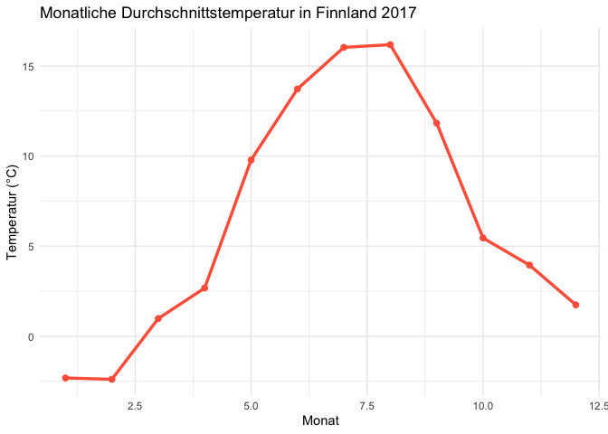

<br>

**Beschreibung:**  
Wie verhalten sich Wetter und Schnee in Finnland über ein Jahr hinweg?
Dieser Datensatz dokumentiert tägliche Temperaturen, Niederschlag und
Schneehöhen für 2017. Mit aggregierten Monatswerten, Trendlinien und
Visualisierungen werden saisonale Muster und Extreme erkennbar.

**Ziel:**  
Es sollen monatliche Trends und Muster bei Temperatur, Niederschlag und
Schneehöhe identifiziert werden.  
Zusätzlich werden aussagekräftige Visualisierungen erstellt, um
saisonale Unterschiede zu erkennen.

<br>

#### Bibliotheken

``` r
#### Bibliotheken
library(tidyverse)
```

    ## ── Attaching core tidyverse packages ──────────────────────── tidyverse 2.0.0 ──
    ## ✔ dplyr     1.1.4     ✔ readr     2.1.5
    ## ✔ forcats   1.0.1     ✔ stringr   1.5.2
    ## ✔ ggplot2   4.0.0     ✔ tibble    3.3.0
    ## ✔ lubridate 1.9.4     ✔ tidyr     1.3.1
    ## ✔ purrr     1.1.0     
    ## ── Conflicts ────────────────────────────────────────── tidyverse_conflicts() ──
    ## ✖ dplyr::filter() masks stats::filter()
    ## ✖ dplyr::lag()    masks stats::lag()
    ## ℹ Use the conflicted package (<http://conflicted.r-lib.org/>) to force all conflicts to become errors

<br>

#### Datensatz einlesen und Überblick

``` r
wetter_finnland <- read.csv('data/finnland-weather-2017.csv', header = TRUE)

# Erste Zeilen
head(wetter_finnland)
```

    ##   Year m d  Time Time.zone Precipitation.amount..mm. Snow.depth..cm.
    ## 1 2017 1 1 00:00       UTC                      -1.0              -1
    ## 2 2017 1 2 00:00       UTC                       4.4              -1
    ## 3 2017 1 3 00:00       UTC                       6.6               7
    ## 4 2017 1 4 00:00       UTC                      -1.0              13
    ## 5 2017 1 5 00:00       UTC                      -1.0              10
    ## 6 2017 1 6 00:00       UTC                       0.3              10
    ##   Air.temperature..degC.
    ## 1                    0.6
    ## 2                   -3.9
    ## 3                   -6.5
    ## 4                  -12.8
    ## 5                  -17.8
    ## 6                  -17.8

``` r
# Struktur prüfen
str(wetter_finnland)
```

    ## 'data.frame':    365 obs. of  8 variables:
    ##  $ Year                     : int  2017 2017 2017 2017 2017 2017 2017 2017 2017 2017 ...
    ##  $ m                        : int  1 1 1 1 1 1 1 1 1 1 ...
    ##  $ d                        : int  1 2 3 4 5 6 7 8 9 10 ...
    ##  $ Time                     : chr  "00:00" "00:00" "00:00" "00:00" ...
    ##  $ Time.zone                : chr  "UTC" "UTC" "UTC" "UTC" ...
    ##  $ Precipitation.amount..mm.: num  -1 4.4 6.6 -1 -1 0.3 5.3 -1 1.1 0.3 ...
    ##  $ Snow.depth..cm.          : int  -1 -1 7 13 10 10 10 12 12 9 ...
    ##  $ Air.temperature..degC.   : num  0.6 -3.9 -6.5 -12.8 -17.8 -17.8 -3.8 -0.5 0.5 1.7 ...

``` r
# Zusammenfassung
summary(wetter_finnland)
```

    ##       Year            m                d             Time          
    ##  Min.   :2017   Min.   : 1.000   Min.   : 1.00   Length:365        
    ##  1st Qu.:2017   1st Qu.: 4.000   1st Qu.: 8.00   Class :character  
    ##  Median :2017   Median : 7.000   Median :16.00   Mode  :character  
    ##  Mean   :2017   Mean   : 6.526   Mean   :15.72                     
    ##  3rd Qu.:2017   3rd Qu.:10.000   3rd Qu.:23.00                     
    ##  Max.   :2017   Max.   :12.000   Max.   :31.00                     
    ##                                                                    
    ##   Time.zone         Precipitation.amount..mm. Snow.depth..cm.  
    ##  Length:365         Min.   :-1.000            Min.   :-1.0000  
    ##  Class :character   1st Qu.:-1.000            1st Qu.:-1.0000  
    ##  Mode  :character   Median : 0.200            Median :-1.0000  
    ##                     Mean   : 1.966            Mean   : 0.9665  
    ##                     3rd Qu.: 2.700            3rd Qu.: 0.0000  
    ##                     Max.   :35.000            Max.   :15.0000  
    ##                                               NA's   :7        
    ##  Air.temperature..degC.
    ##  Min.   :-17.800       
    ##  1st Qu.:  1.200       
    ##  Median :  4.800       
    ##  Mean   :  6.527       
    ##  3rd Qu.: 12.900       
    ##  Max.   : 19.600       
    ## 

<br>

#### Datenbereinigung & lesbare Spaltennamen

``` r
wetter_finnland_leserlich <- wetter_finnland %>% 
  rename(
    Jahr = Year,
    Monat = m,
    Tag = d,
    Zeit = Time,
    Zeitzone = Time.zone,
    `Niederschlag (mm)` = Precipitation.amount..mm.,
    `Schneehöhe (cm)` = Snow.depth..cm.,
    `Temperatur (°C)` = Air.temperature..degC. 
  )

# NA-Werte und Sonderwerte bereinigen
wetter_finnland_bereinigt <- wetter_finnland_leserlich %>%
  mutate(
    `Niederschlag (mm)` = ifelse(`Niederschlag (mm)` == -1, 0, `Niederschlag (mm)`),
    `Schneehöhe (cm)` = as.numeric(ifelse(`Schneehöhe (cm)` %in% c(-1, ''), NA, `Schneehöhe (cm)`))
  )
```

<br>

#### Monatliche Aggregation

``` r
wetter_finnland_Monate <- wetter_finnland_bereinigt %>% 
  group_by(Monat) %>% 
  summarise(
    Temperatur_Mittel = mean(`Temperatur (°C)`, na.rm = TRUE),
    Temperatur_Max = max(`Temperatur (°C)`, na.rm = TRUE),
    Temperatur_Min = min(`Temperatur (°C)`, na.rm = TRUE),
    Niederschlag_Gesamt = sum(`Niederschlag (mm)`, na.rm = TRUE),
    Schneehöhe_Mittel = mean(`Schneehöhe (cm)`, na.rm = TRUE),
    Tage_Schnee = sum(`Schneehöhe (cm)` > 0, na.rm = TRUE)
  )

wetter_finnland_Monate
```

    ## # A tibble: 12 × 7
    ##    Monat Temperatur_Mittel Temperatur_Max Temperatur_Min Niederschlag_Gesamt
    ##    <int>             <dbl>          <dbl>          <dbl>               <dbl>
    ##  1     1            -2.32             1.9          -17.8                38.9
    ##  2     2            -2.39             4.4          -12.1                35  
    ##  3     3             0.984            6.6           -4.2                41.7
    ##  4     4             2.68             6             -1.7                39.9
    ##  5     5             9.78            16.9            1.5                16.1
    ##  6     6            13.7             19.3            6.2                76.3
    ##  7     7            16.0             19.1           11.5                31.2
    ##  8     8            16.2             19.6           10.4                86.1
    ##  9     9            11.8             15.1            8.7                65.2
    ## 10    10             5.45            11.2           -0.4               184. 
    ## 11    11             3.95             8.4            0.1               120. 
    ## 12    12             1.74             5.2           -1.2               141. 
    ## # ℹ 2 more variables: Schneehöhe_Mittel <dbl>, Tage_Schnee <int>

<br>

#### Visualisierungen

``` r
# 1. Durchschnittstemperatur pro Monat
ggplot(wetter_finnland_Monate, aes(x = Monat, y = Temperatur_Mittel)) +
  geom_line(color = "tomato", size = 1.2) +
  geom_point(color = "tomato", size = 2) +
  labs(
    title = 'Monatliche Durchschnittstemperatur in Finnland 2017',
    x = 'Monat',
    y = 'Temperatur (°C)'
  ) +
  theme_minimal()
```

    ## Warning: Using `size` aesthetic for lines was deprecated in ggplot2 3.4.0.
    ## ℹ Please use `linewidth` instead.
    ## This warning is displayed once every 8 hours.
    ## Call `lifecycle::last_lifecycle_warnings()` to see where this warning was
    ## generated.



``` r
# 2. Gesamtniederschlag pro Monat
ggplot(wetter_finnland_Monate, aes(x = Monat, y = Niederschlag_Gesamt)) +
  geom_col(fill = "steelblue") +
  labs(
    title = 'Gesamtniederschlag pro Monat in Finnland 2017',
    x = 'Monat',
    y = 'Niederschlag (mm)'
  ) +
  theme_minimal()
```


``` r
# 3. Durchschnittliche Schneehöhe pro Monat
ggplot(wetter_finnland_Monate, aes(x = Monat, y = Schneehöhe_Mittel)) +
  geom_col(fill = "lightblue") +
  labs(
    title = 'Durchschnittliche Schneehöhe pro Monat in Finnland 2017',
    x = 'Monat',
    y = 'Schneehöhe (cm)'
  ) +
  theme_minimal()
```

    ## Warning: Removed 5 rows containing missing values or values outside the scale range
    ## (`geom_col()`).


``` r
# 4. Tage mit Schneedecke pro Monat
ggplot(wetter_finnland_Monate, aes(x = Monat, y = Tage_Schnee)) +
  geom_col(fill = "darkblue") +
  labs(
    title = 'Anzahl der Tage mit Schneedecke pro Monat',
    x = 'Monat',
    y = 'Tage'
  ) +
  theme_minimal()
```


<br>

### Insights & Interpretation

Saisonale Temperaturen: Wintermonate (Dezember–Februar) am kältesten,
Sommermonate (Juni–August) am wärmsten.

Niederschlag: Höchster Gesamtniederschlag im Sommer, geringe Werte im
Winter.

Schneedecke: Schneehöhe und Anzahl der Schneetage im Winter am höchsten,
ab März deutlich abnehmend.

Trends: Klare saisonale Schwankungen, die Temperaturen, Schneehöhe und
Niederschlag stark beeinflussen.
