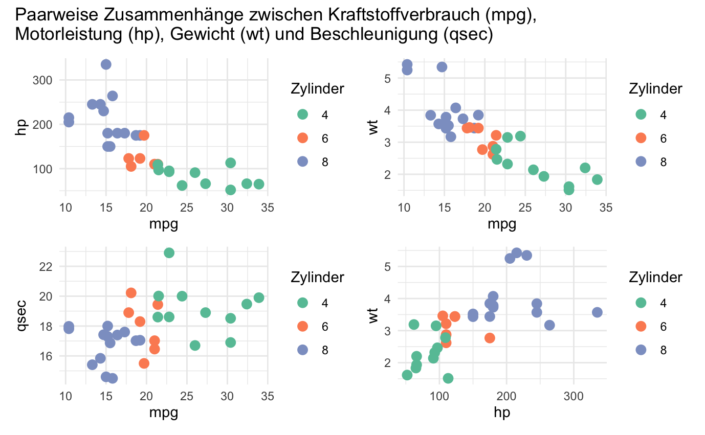

# R Data Portfolio

  
*Auszug aus der Verbrauchs- und Leistungsanalyse mit dem Datensatz mtcars*

---

## Inhaltsverzeichnis
- [Mtcars: Verbrauchs- und Leistungsanalyse](#mtcars-verbrauchs--und-leistungsanalyse)
- [Airquality & CO2: Umweltdatenanalyse](#airquality--co2-umweltdatenanalyse)
- [Star Wars Charakteranalyse](#star-wars-charakteranalyse)
- [Chickwts: Futteranalyse](#chickwts-futteranalyse)
- [Wetter Finnland 2017](#wetter-finnland-2017)
- [Warpbreaks: Fadenbruchanalyse](#warpbreaks-fadenbruchanalyse)
- [R Grundlagen](#r-grundlagen)

---

## Mtcars: Verbrauchs- und Leistungsanalyse
**Beschreibung:**  
Analyse technischer Fahrzeugkennzahlen wie Motorleistung, Gewicht und Kraftstoffverbrauch bei 32 Automodellen.

**Markdown File:** [verbrauchs-und-leistungsanalyse-mtcars.md](verbrauchs-und-leistungsanalyse-mtcars.md)  
**R Script:** [verbrauchs-und-leistungsanalyse-mtcars.R](verbrauchs-und-leistungsanalyse-mtcars.R)

**Highlights:**
- Scatterplots und Korrelationsanalyse
- Boxplots nach Zylinderzahl und Getriebe
- Tabellarische Übersichten zu Motorleistung & Verbrauch

---

## Airquality & CO2: Umweltdatenanalyse
**Beschreibung:**  
Untersuchung von Wetterdaten (New York) und CO2-Aufnahmeraten unterschiedlicher Pflanzentypen.

**Markdown File:** [umweltdatenanalyse-airquality-und-co2.md](umweltdatenanalyse-airquality-und-co2.md)

**R Script:** [umweltdatenanalyse-airquality-und-co2.R](umweltdatenanalyse-airquality-und-co2.R)

**Highlights:**
- Temperatur-Histogramme
- Temperatur vs. Ozon (Scatter + Regression)
- CO2-Aufnahme: Boxplots & Balkendiagramme

---

## Star Wars Charakteranalyse
**Beschreibung:**  
Profilanalyse ikonischer Star-Wars-Charaktere: Größe, Masse, Geschlecht, Spezies, Herkunftsplanet, BMI und mehr.

**Markdown File:** [starwars-charakteranalyse.md](starwars-charakteranalyse.md)  
**R Script:** [starwars-charakteranalyse.R](starwars-charakteranalyse.R)

**Highlights:**
- Größe-vs-Masse Scatter nach Geschlecht
- Häufigkeit verschiedener Spezies
- BMI-Ranking
- Gruppierungen nach Planet, Spezies, Geschlecht

---

## Chickwts: Futteranalyse
**Beschreibung:**  
Vergleich von Kükengewichten je Futterart zur Untersuchung möglicher Wachstumsunterschiede.

**Markdown File:** [chickwts-futteranalyse.md](chickwts-futteranalyse.md)  
**R Script:** [chickwts-futteranalyse.R](chickwts-futteranalyse.R)

**Highlights:**
- Boxplots & Violinplots
- Durchschnittsgewicht pro Futterart
- Einfaches lineares Modell

---

## Wetter Finnland 2017
**Beschreibung:**  
Auswertung täglicher Klimadaten in Finnland 2017: Temperatur, Niederschlag, Schneehöhe & Saisonalität.

**Markdown File:** [wetter-finnland-2017.md](wetter-finnland-2017.md)  
**R Script:** [wetter-finnland-2017.R](wetter-finnland-2017.R)

**Highlights:**
- Temperatur-Monatsmittel
- Niederschlag-Summen je Monat
- Schneehöhenanalyse & Extremwerte

---

## Warpbreaks: Fadenbruchanalyse
**Beschreibung:**  
Untersuchung des Bruchverhaltens von Webfäden unter variierenden Spannungen und mit zwei Wolltypen.

**Markdown File:** [warpbreaks-fadenbruchanalyse.md](warpbreaks-fadenbruchanalyse.md)  
**R Script:** [warpbreaks-fadenbruchanalyse.R](warpbreaks-fadenbruchanalyse.R)

**Highlights:**
- Boxplots nach Wolltyp & Spannung
- Lagemaße (Mittelwert, Median, SD)
- Kreuztabellen & Interaktionen

---

## R Grundlagen 
**Beschreibung:**  
Grundlagenübungen zu Datentypen, Datenstrukturen, Kontrollfluss, Funktionen, Statistik, Datenimport & Visualisierung.

**Markdown File:** [r-grundlagen.md](r-grundlagen.md)  
**R Script:** [r-grundlagen.R](r-grundlagen.R)

**Highlights:**
- Arbeiten mit Listen & Dataframes
- Schleifen & Bedingungen
- Statistik-Grundlagen
- Import/Export (CSV, Excel)
- Basis-Plots
