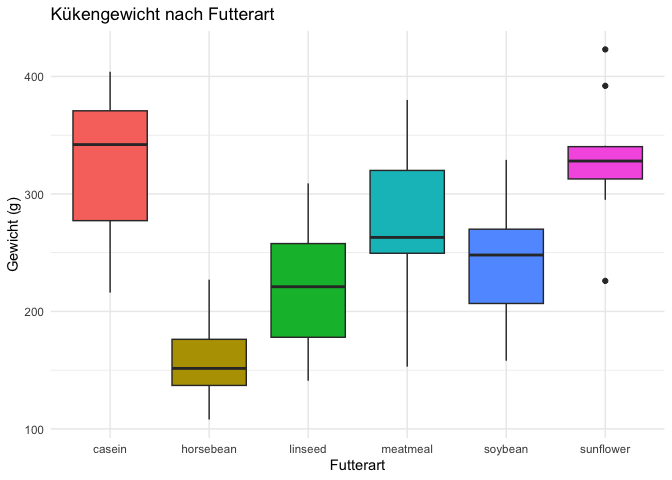
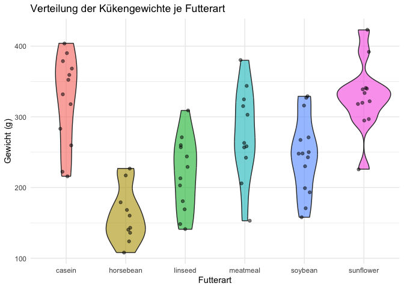
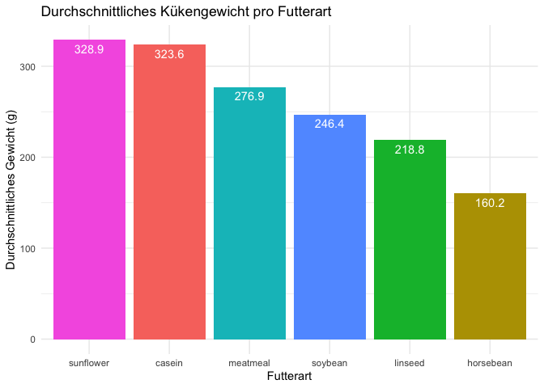

**Beschreibung:**  
Küken und ihre Futterpräferenzen: Welche Futterarten fördern das
Wachstum am meisten? Dieser Datensatz liefert Informationen zu Gewichten
von Küken unter verschiedenen Futterarten. Mit gruppierten Statistiken,
Boxplots, Violinplots und linearen Modellen werden Unterschiede sichtbar
gemacht und Muster im Wachstum der Tiere identifiziert.

**Ziel:**  
Es sollen zentrale statistische Kennzahlen, gruppierte Auswertungen und
Visualisierungen erstellt werden, um den Einfluss der Futterart auf das
Kükengewicht zu untersuchen.

<br>

#### Bibliotheken

``` r
library(tidyverse)
```

    ## ── Attaching core tidyverse packages ──────────────────────── tidyverse 2.0.0 ──
    ## ✔ dplyr     1.1.4     ✔ readr     2.1.5
    ## ✔ forcats   1.0.1     ✔ stringr   1.5.2
    ## ✔ ggplot2   4.0.0     ✔ tibble    3.3.0
    ## ✔ lubridate 1.9.4     ✔ tidyr     1.3.1
    ## ✔ purrr     1.1.0     
    ## ── Conflicts ────────────────────────────────────────── tidyverse_conflicts() ──
    ## ✖ dplyr::filter() masks stats::filter()
    ## ✖ dplyr::lag()    masks stats::lag()
    ## ℹ Use the conflicted package (<http://conflicted.r-lib.org/>) to force all conflicts to become errors

<br>

#### Überblick über den Datensatz

``` r
# Erste Zeilen und Struktur
head(chickwts)
```

    ##   weight      feed
    ## 1    179 horsebean
    ## 2    160 horsebean
    ## 3    136 horsebean
    ## 4    227 horsebean
    ## 5    217 horsebean
    ## 6    168 horsebean

``` r
str(chickwts)
```

    ## 'data.frame':    71 obs. of  2 variables:
    ##  $ weight: num  179 160 136 227 217 168 108 124 143 140 ...
    ##  $ feed  : Factor w/ 6 levels "casein","horsebean",..: 2 2 2 2 2 2 2 2 2 2 ...

``` r
# Zusammenfassung
summary(chickwts)
```

    ##      weight             feed   
    ##  Min.   :108.0   casein   :12  
    ##  1st Qu.:204.5   horsebean:10  
    ##  Median :258.0   linseed  :12  
    ##  Mean   :261.3   meatmeal :11  
    ##  3rd Qu.:323.5   soybean  :14  
    ##  Max.   :423.0   sunflower:12

<br>

#### Lagemaße nach Futterart

``` r
# Lagemaße nach Futterart
# Durchschnitt, Median, Standardabweichung, Min, Max, Anzahl pro Futterart

chickwts_summary <- chickwts %>%
group_by(feed) %>%
summarise(
Durchschnittsgewicht = mean(weight),
Median_Gewicht = median(weight),
Std_Gewicht = sd(weight),
Minimalgewicht = min(weight),
Maximalgewicht = max(weight),
Anzahl_Küken = n()
) %>%
arrange(desc(Durchschnittsgewicht))

chickwts_summary
```

    ## # A tibble: 6 × 7
    ##   feed      Durchschnittsgewicht Median_Gewicht Std_Gewicht Minimalgewicht
    ##   <fct>                    <dbl>          <dbl>       <dbl>          <dbl>
    ## 1 sunflower                 329.           328         48.8            226
    ## 2 casein                    324.           342         64.4            216
    ## 3 meatmeal                  277.           263         64.9            153
    ## 4 soybean                   246.           248         54.1            158
    ## 5 linseed                   219.           221         52.2            141
    ## 6 horsebean                 160.           152.        38.6            108
    ## # ℹ 2 more variables: Maximalgewicht <dbl>, Anzahl_Küken <int>

<br>

#### Visualisierungen

``` r
# Boxplot: Gewicht nach Futterart

ggplot(chickwts, aes(x = feed, y = weight, fill = feed)) +
geom_boxplot() +
labs(
title = 'Kükengewicht nach Futterart',
x = 'Futterart',
y = 'Gewicht (g)'
) +
theme_minimal() +
theme(legend.position = "none")
```



<br>

``` r
# Violinplot + Punktwolke (Jitter)

ggplot(chickwts, aes(x = feed, y = weight, fill = feed)) +
geom_violin(alpha = 0.6) +
geom_jitter(width = 0.1, alpha = 0.5) +
labs(
title = 'Verteilung der Kükengewichte je Futterart',
x = 'Futterart',
y = 'Gewicht (g)'
) +
theme_minimal() +
theme(legend.position = "none")
```



<br>

``` r
# Balkendiagramm: Durchschnittsgewicht pro Futterartggplot

ggplot(chickwts_summary, aes(x = reorder(feed, -Durchschnittsgewicht), y = Durchschnittsgewicht, fill = feed)) +
geom_col() +
geom_text(aes(label = round(Durchschnittsgewicht,1)), vjust = 1.5, color = "white") +
labs(
title = 'Durchschnittliches Kükengewicht pro Futterart',
x = 'Futterart',
y = 'Durchschnittliches Gewicht (g)'
) +
theme_minimal() +
theme(legend.position = "none")
```



<br>

``` r
# Lineares Modell: Einfluss der Futterart

# Referenzlevel für Futterart festlegen
chickwts$feed <- relevel(chickwts$feed, ref = "horsebean")

# Lineares Modell
model <- lm(weight ~ feed, data = chickwts)

summary(model)
```

    ## 
    ## Call:
    ## lm(formula = weight ~ feed, data = chickwts)
    ## 
    ## Residuals:
    ##      Min       1Q   Median       3Q      Max 
    ## -123.909  -34.413    1.571   38.170  103.091 
    ## 
    ## Coefficients:
    ##               Estimate Std. Error t value Pr(>|t|)    
    ## (Intercept)     160.20      17.35   9.236 1.91e-13 ***
    ## feedcasein      163.38      23.49   6.957 2.07e-09 ***
    ## feedlinseed      58.55      23.49   2.493 0.015222 *  
    ## feedmeatmeal    116.71      23.97   4.870 7.48e-06 ***
    ## feedsoybean      86.23      22.71   3.797 0.000325 ***
    ## feedsunflower   168.72      23.49   7.184 8.20e-10 ***
    ## ---
    ## Signif. codes:  0 '***' 0.001 '**' 0.01 '*' 0.05 '.' 0.1 ' ' 1
    ## 
    ## Residual standard error: 54.85 on 65 degrees of freedom
    ## Multiple R-squared:  0.5417, Adjusted R-squared:  0.5064 
    ## F-statistic: 15.36 on 5 and 65 DF,  p-value: 5.936e-10

<br>

### Zusammenfassung & Insights

- Futterart beeinflusst das Kükengewicht deutlich.  
- Küken, die „meatmeal“ oder „soybean“ erhalten, wiegen im Durchschnitt
  mehr als die - Referenzgruppe „horsebean“.  
- Boxplots und Violinplots zeigen die Verteilung und Streuung der
  Gewichte je Futterart.  
- Das lineare Modell bestätigt statistisch signifikante Unterschiede
  zwischen den Futterarten.  
- Die Visualisierungen verdeutlichen sowohl mittlere Unterschiede als
  auch Varianz innerhalb der Gruppen.
