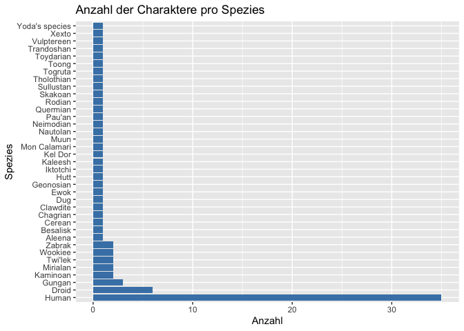
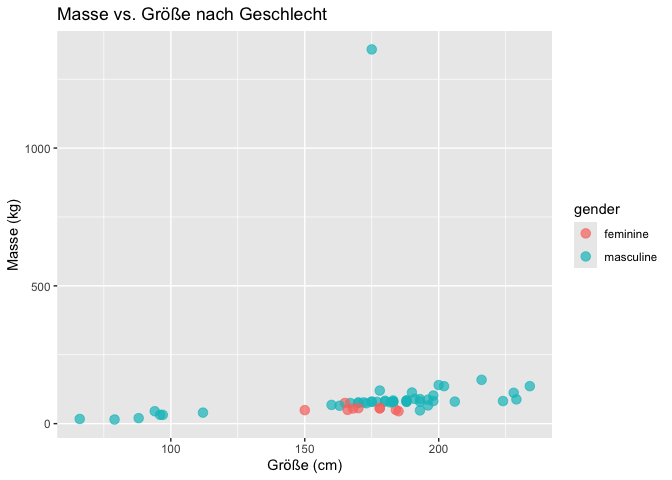
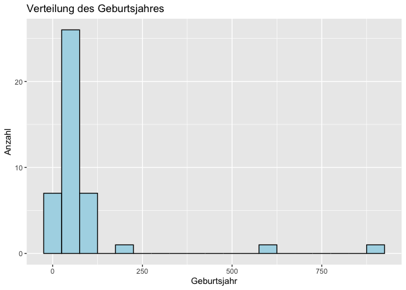
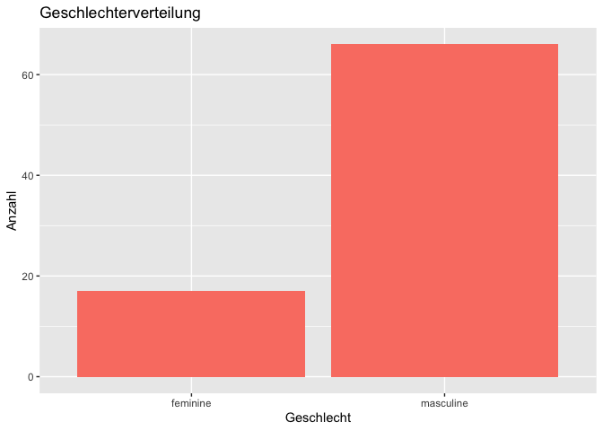
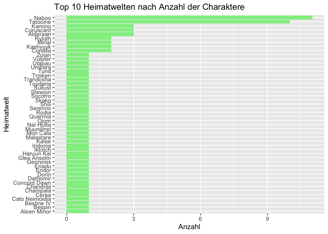
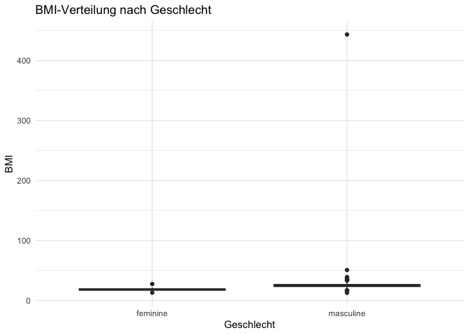
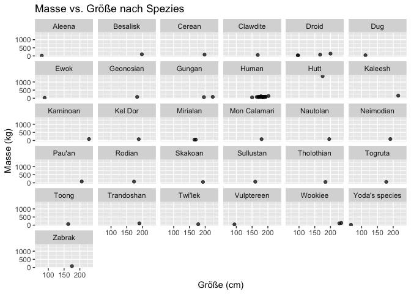

<br> **Beschreibung:**  
Wir erkunden den starwars-Datensatz aus dem R-Paket dplyr und beleuchten
die Charaktere des Star Wars Universums. Untersucht werden Körpergröße,
Gewicht, Spezies, Geschlecht, Haar- und Hautfarbe, Heimatwelt sowie
Geburtsjahr, um Muster, Besonderheiten und Zusammenhänge zwischen den
Figuren sichtbar zu machen.

**Ziel:**  
Zentrale Charaktermerkmale sollen untersucht werden, um statistische
Zusammenhänge zu identifizieren und visuell aufzubereiten.  
Unterschiede zwischen Geschlechtern, Spezies und Planeten werden
analysiert, ebenso wie Beziehungen zwischen Größe, Masse, BMI und
anderen Variablen.

<br>

#### Bibliotheken

``` r
library(tidyverse)
```

    ## ── Attaching core tidyverse packages ──────────────────────── tidyverse 2.0.0 ──
    ## ✔ dplyr     1.1.4     ✔ readr     2.1.5
    ## ✔ forcats   1.0.1     ✔ stringr   1.5.2
    ## ✔ ggplot2   4.0.0     ✔ tibble    3.3.0
    ## ✔ lubridate 1.9.4     ✔ tidyr     1.3.1
    ## ✔ purrr     1.1.0     
    ## ── Conflicts ────────────────────────────────────────── tidyverse_conflicts() ──
    ## ✖ dplyr::filter() masks stats::filter()
    ## ✖ dplyr::lag()    masks stats::lag()
    ## ℹ Use the conflicted package (<http://conflicted.r-lib.org/>) to force all conflicts to become errors

``` r
library(forcats)
```

<br>

#### Überblick über den Datensatz

``` r
# Überblick über die Struktur des Starwars-Datensatzes
glimpse(starwars)
```

    ## Rows: 87
    ## Columns: 14
    ## $ name       <chr> "Luke Skywalker", "C-3PO", "R2-D2", "Darth Vader", "Leia Or…
    ## $ height     <int> 172, 167, 96, 202, 150, 178, 165, 97, 183, 182, 188, 180, 2…
    ## $ mass       <dbl> 77.0, 75.0, 32.0, 136.0, 49.0, 120.0, 75.0, 32.0, 84.0, 77.…
    ## $ hair_color <chr> "blond", NA, NA, "none", "brown", "brown, grey", "brown", N…
    ## $ skin_color <chr> "fair", "gold", "white, blue", "white", "light", "light", "…
    ## $ eye_color  <chr> "blue", "yellow", "red", "yellow", "brown", "blue", "blue",…
    ## $ birth_year <dbl> 19.0, 112.0, 33.0, 41.9, 19.0, 52.0, 47.0, NA, 24.0, 57.0, …
    ## $ sex        <chr> "male", "none", "none", "male", "female", "male", "female",…
    ## $ gender     <chr> "masculine", "masculine", "masculine", "masculine", "femini…
    ## $ homeworld  <chr> "Tatooine", "Tatooine", "Naboo", "Tatooine", "Alderaan", "T…
    ## $ species    <chr> "Human", "Droid", "Droid", "Human", "Human", "Human", "Huma…
    ## $ films      <list> <"A New Hope", "The Empire Strikes Back", "Return of the J…
    ## $ vehicles   <list> <"Snowspeeder", "Imperial Speeder Bike">, <>, <>, <>, "Imp…
    ## $ starships  <list> <"X-wing", "Imperial shuttle">, <>, <>, "TIE Advanced x1",…

``` r
# Erste 6 Zeilen und Anzahl der Spalten anzeigen
head(starwars)
```

    ## # A tibble: 6 × 14
    ##   name      height  mass hair_color skin_color eye_color birth_year sex   gender
    ##   <chr>      <int> <dbl> <chr>      <chr>      <chr>          <dbl> <chr> <chr> 
    ## 1 Luke Sky…    172    77 blond      fair       blue            19   male  mascu…
    ## 2 C-3PO        167    75 <NA>       gold       yellow         112   none  mascu…
    ## 3 R2-D2         96    32 <NA>       white, bl… red             33   none  mascu…
    ## 4 Darth Va…    202   136 none       white      yellow          41.9 male  mascu…
    ## 5 Leia Org…    150    49 brown      light      brown           19   fema… femin…
    ## 6 Owen Lars    178   120 brown, gr… light      blue            52   male  mascu…
    ## # ℹ 5 more variables: homeworld <chr>, species <chr>, films <list>,
    ## #   vehicles <list>, starships <list>

<br>

#### Basis-Statistiken

``` r
# Anzahl der Charaktere pro Spezies
starwars %>% 
  filter(!is.na(species)) %>% 
  count(species, sort = TRUE)
```

    ## # A tibble: 37 × 2
    ##    species      n
    ##    <chr>    <int>
    ##  1 Human       35
    ##  2 Droid        6
    ##  3 Gungan       3
    ##  4 Kaminoan     2
    ##  5 Mirialan     2
    ##  6 Twi'lek      2
    ##  7 Wookiee      2
    ##  8 Zabrak       2
    ##  9 Aleena       1
    ## 10 Besalisk     1
    ## # ℹ 27 more rows

``` r
# Durchschnittliche Größe und Masse pro Geschlecht
starwars %>% 
  filter(!is.na(height) & !is.na(mass) & !is.na(gender)) %>%
  group_by(gender) %>%
  summarise(
    Durchschnittsgröße = mean(height),
    Durchschnittsmasse = mean(mass),
    Anzahl_Charaktere = n()
  )
```

    ## # A tibble: 2 × 4
    ##   gender    Durchschnittsgröße Durchschnittsmasse Anzahl_Charaktere
    ##   <chr>                  <dbl>              <dbl>             <int>
    ## 1 feminine                172.               54.7                 9
    ## 2 masculine               174.              107.                 47

``` r
# Anzahl fehlender Werte
sapply(starwars, function(x) sum(is.na(x)))
```

    ##       name     height       mass hair_color skin_color  eye_color birth_year 
    ##          0          6         28          5          0          0         44 
    ##        sex     gender  homeworld    species      films   vehicles  starships 
    ##          4          4         10          4          0          0          0

<br>

#### BMI Berechnung

``` r
starwars_bmi <- starwars %>%
  filter(!is.na(mass) & !is.na(height)) %>%
  mutate(bmi = mass / (height/100)^2)

# Top 10 Charaktere nach BMI
starwars_bmi %>% arrange(desc(bmi)) %>% select(name, mass, height, bmi) %>% head(10)
```

    ## # A tibble: 10 × 4
    ##    name                   mass height   bmi
    ##    <chr>                 <dbl>  <int> <dbl>
    ##  1 Jabba Desilijic Tiure  1358    175 443. 
    ##  2 Dud Bolt                 45     94  50.9
    ##  3 Yoda                     17     66  39.0
    ##  4 Owen Lars               120    178  37.9
    ##  5 IG-88                   140    200  35  
    ##  6 R2-D2                    32     96  34.7
    ##  7 Grievous                159    216  34.1
    ##  8 R5-D4                    32     97  34.0
    ##  9 Jek Tono Porkins        110    180  34.0
    ## 10 Darth Vader             136    202  33.3

<br>

#### Visualisierungen

``` r
# 1. Anzahl der Charaktere pro Spezies
starwars %>% 
  filter(!is.na(species)) %>% 
  ggplot(aes(y = fct_infreq(species))) +
  geom_bar(fill = 'steelblue') +
  labs(title = 'Anzahl der Charaktere pro Spezies', y = 'Spezies', x = 'Anzahl')
```


<br>

``` r
# 2. Scatterplot: Masse vs. Größe nach Geschlecht
starwars %>% 
  filter(!is.na(height) & !is.na(mass) & !is.na(gender)) %>%
  ggplot(aes(x = height, y = mass, color = gender)) +
  geom_point(size = 3, alpha = 0.7) +
  labs(title = 'Masse vs. Größe nach Geschlecht', x = 'Größe (cm)', y = 'Masse (kg)')
```


<br>

``` r
# 3. Histogramm: Alter (birth_year)
starwars %>% 
  filter(!is.na(birth_year)) %>%
  ggplot(aes(x = birth_year)) +
  geom_histogram(binwidth = 50, fill = 'lightblue', color = 'black') +
  labs(title = 'Verteilung des Geburtsjahres', x = 'Geburtsjahr', y = 'Anzahl')
```



<br>

``` r
# 4. Balkendiagramm: Geschlechterverteilung
starwars %>% 
  filter(!is.na(gender)) %>%
  ggplot(aes(x = gender)) +
  geom_bar(fill = 'salmon') +
  labs(title = 'Geschlechterverteilung', x = 'Geschlecht', y = 'Anzahl')
```



<br>

``` r
# 5. Top 10 Heimatwelten
starwars %>% 
  filter(!is.na(homeworld)) %>%
  count(homeworld, sort = TRUE) %>%
  top_n(10) %>%
  ggplot(aes(x = reorder(homeworld, n), y = n)) +
  geom_col(fill = 'lightgreen') +
  coord_flip() +
  labs(title = 'Top 10 Heimatwelten nach Anzahl der Charaktere', x = 'Heimatwelt', y = 'Anzahl')
```

    ## Selecting by n


<br>

``` r
# 6. BMI-Boxplot nach Geschlecht
starwars_bmi %>%
  filter(!is.na(gender)) %>%
  ggplot(aes(x = gender, y = bmi, fill = gender)) +
  geom_boxplot() +
  labs(title = 'BMI-Verteilung nach Geschlecht', x = 'Geschlecht', y = 'BMI') +
  theme_minimal() +
  theme(legend.position = 'none')
```



<br>

``` r
# 7. Scatterplot: Masse vs. Größe facettiert nach Spezies
starwars %>%
  filter(!is.na(height) & !is.na(mass) & !is.na(species)) %>%
  ggplot(aes(x = height, y = mass)) +
  geom_point(alpha = 0.7) +
  facet_wrap(~ species) +
  labs(title = 'Masse vs. Größe nach Spezies', x = 'Größe (cm)', y = 'Masse (kg)')
```


<br>

### Insights

Körpergröße & Masse: Charaktere der Spezies „Droid“ sind oft kleiner und
leichter; Twi‘lek und Wookiee sind groß und schwer.

BMI: Stark variierende BMI-Werte zwischen Spezies; Droiden haben extrem
niedrige Werte.

Geschlecht: Weniger weibliche Charaktere; Frauen sind im Durchschnitt
kleiner und leichter.

Heimatwelt: Correlates mit Spezies – viele Charaktere stammen von
Planeten mit mehreren bekannten Individuen (z.B. Naboo, Tatooine).

Alter: Große Streuung im Geburtsjahr; einige Charaktere sehr alt
(Jahrhundertbereiche).

Zusammenhänge: Masse korreliert positiv mit Größe; BMI ermöglicht
Vergleich zwischen Spezies unabhängig von Größe.
