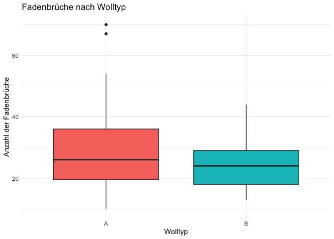
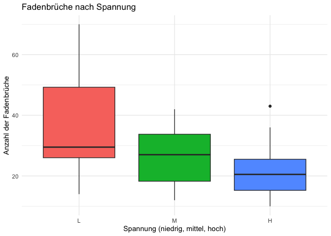
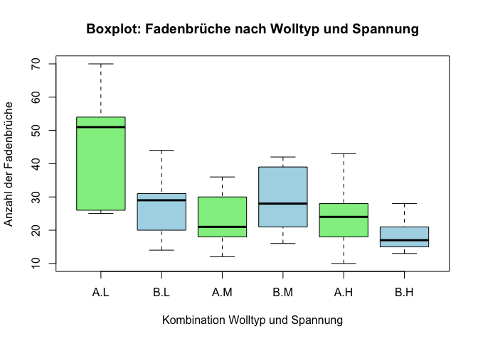
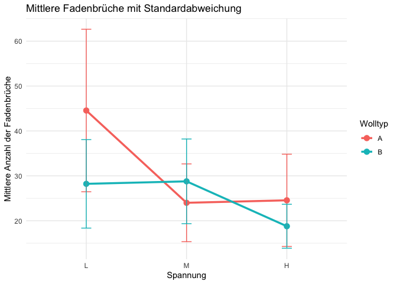

<br> **Beschreibung:**  
Der `warpbreaks`-Datensatz enthält experimentelle Daten zur Anzahl der
Fadenbrüche in Webstühlen, die mit unterschiedlichen Wolltypen (wool)
und verschiedenen Spannungsstufen (tension) betrieben wurden. Wir
untersuchen den Einflusses von Wolltyp und Spannung auf die Fadenbrüche
und identifizieren potenzielle Interaktionen zwischen beiden Faktoren.

**Analysen:**  
- Überblick und Datenstruktur  
- Häufigkeitsverteilung der Wolltypen und Spannungskategorien  
- Kreuztabelle (Wolltyp × Spannung)  
- Deskriptive Statistiken der Fadenbrüche (Lagemaße, Streuung)  
- Gruppenvergleiche nach Wolltyp und Spannung  
- Visualisierungen der Fadenbrüche:  
- Boxplots nach Wolltyp  
- Boxplots nach Spannung  
- Interaktion: Wolltyp × Spannung  
- Mittelwertdiagramm mit Fehlerbalken  
- Explorative Fragestellungen:  
- Welcher Wolltyp zeigt im Mittel die meisten bzw. wenigsten
Fadenbrüche?  
- Hat die Spannung einen signifikanten Einfluss auf die
Bruchhäufigkeit?  
- Gibt es eine Wechselwirkung zwischen Wolltyp und Spannung?

**Ziel:**  
Quantitative und visuelle Analyse der Produktionsdaten, um Unterschiede
und Einflussfaktoren der Fadenbrüche in Abhängigkeit von Material und
Maschinenspannung zu identifizieren.

<br>

#### Bibliotheken

``` r
# Installation falls erforderlich
packages <- c("tidyverse")
installed <- packages %in% rownames(installed.packages())
if (any(!installed)) install.packages(packages[!installed])

library(tidyverse)
```

    ## ── Attaching core tidyverse packages ──────────────────────── tidyverse 2.0.0 ──
    ## ✔ dplyr     1.1.4     ✔ readr     2.1.5
    ## ✔ forcats   1.0.1     ✔ stringr   1.5.2
    ## ✔ ggplot2   4.0.0     ✔ tibble    3.3.0
    ## ✔ lubridate 1.9.4     ✔ tidyr     1.3.1
    ## ✔ purrr     1.1.0     
    ## ── Conflicts ────────────────────────────────────────── tidyverse_conflicts() ──
    ## ✖ dplyr::filter() masks stats::filter()
    ## ✖ dplyr::lag()    masks stats::lag()
    ## ℹ Use the conflicted package (<http://conflicted.r-lib.org/>) to force all conflicts to become errors

<br>

#### Überblick über den Datensatz

``` r
# Zeige die ersten Zeilen
head(warpbreaks)
```

    ##   breaks wool tension
    ## 1     26    A       L
    ## 2     30    A       L
    ## 3     54    A       L
    ## 4     25    A       L
    ## 5     70    A       L
    ## 6     52    A       L

``` r
# Struktur und Variablen prüfen
str(warpbreaks)
```

    ## 'data.frame':    54 obs. of  3 variables:
    ##  $ breaks : num  26 30 54 25 70 52 51 26 67 18 ...
    ##  $ wool   : Factor w/ 2 levels "A","B": 1 1 1 1 1 1 1 1 1 1 ...
    ##  $ tension: Factor w/ 3 levels "L","M","H": 1 1 1 1 1 1 1 1 1 2 ...

<br>

#### Häufigkeitsverteilungen

``` r
# Häufigkeitstabelle der Wolltypen
wool_tabelle <- table(warpbreaks$wool)
print(wool_tabelle)
```

    ## 
    ##  A  B 
    ## 27 27

``` r
# dplyr-Alternative
warpbreaks %>% count(wool)
```

    ##   wool  n
    ## 1    A 27
    ## 2    B 27

<br>

#### Kreuztabellen

``` r
# Kreuztabelle Wolle und Spannung
wool_tension_tbl <- table(warpbreaks$wool, warpbreaks$tension)
print(wool_tension_tbl)
```

    ##    
    ##     L M H
    ##   A 9 9 9
    ##   B 9 9 9

``` r
warpbreaks %>% count(wool, tension)
```

    ##   wool tension n
    ## 1    A       L 9
    ## 2    A       M 9
    ## 3    A       H 9
    ## 4    B       L 9
    ## 5    B       M 9
    ## 6    B       H 9

``` r
# Zusammenfassung der Daten
summary(warpbreaks)
```

    ##      breaks      wool   tension
    ##  Min.   :10.00   A:27   L:18   
    ##  1st Qu.:18.25   B:27   M:18   
    ##  Median :26.00          H:18   
    ##  Mean   :28.15                 
    ##  3rd Qu.:34.00                 
    ##  Max.   :70.00

<br>

#### Lage- und Streuungsmaße der Fadenbrüche

``` r
# Lage- und Streuungsmaße der Fadenbrüche
mean(warpbreaks$breaks)
```

    ## [1] 28.14815

``` r
median(warpbreaks$breaks)
```

    ## [1] 26

``` r
sd(warpbreaks$breaks)
```

    ## [1] 13.19864

``` r
var(warpbreaks$breaks)
```

    ## [1] 174.2041

``` r
range(warpbreaks$breaks)
```

    ## [1] 10 70

``` r
# Gruppierte Lagemaße nach Wolltyp
warpbreaks %>%
  group_by(wool) %>%
  summarise(
    mean_brk = mean(breaks),
    median_brk = median(breaks),
    std_brk = sd(breaks)
  )
```

    ## # A tibble: 2 × 4
    ##   wool  mean_brk median_brk std_brk
    ##   <fct>    <dbl>      <dbl>   <dbl>
    ## 1 A         31.0         26   15.9 
    ## 2 B         25.3         24    9.30

``` r
# Gruppierte Lagemaße nach Wolltyp und Spannung
kombi <- warpbreaks %>%
  group_by(wool, tension) %>%
  summarise(
    mean_break = mean(breaks),
    std_break = sd(breaks)
  )
```

    ## `summarise()` has grouped output by 'wool'. You can override using the
    ## `.groups` argument.

``` r
print(kombi)
```

    ## # A tibble: 6 × 4
    ## # Groups:   wool [2]
    ##   wool  tension mean_break std_break
    ##   <fct> <fct>        <dbl>     <dbl>
    ## 1 A     L             44.6     18.1 
    ## 2 A     M             24        8.66
    ## 3 A     H             24.6     10.3 
    ## 4 B     L             28.2      9.86
    ## 5 B     M             28.8      9.43
    ## 6 B     H             18.8      4.89

``` r
# Alternative mit aggregate (Basis R)
aggregate(breaks ~ wool + tension, data = warpbreaks, FUN = mean)
```

    ##   wool tension   breaks
    ## 1    A       L 44.55556
    ## 2    B       L 28.22222
    ## 3    A       M 24.00000
    ## 4    B       M 28.77778
    ## 5    A       H 24.55556
    ## 6    B       H 18.77778

``` r
aggregate(breaks ~ wool + tension, data = warpbreaks, FUN = sd)
```

    ##   wool tension    breaks
    ## 1    A       L 18.097729
    ## 2    B       L  9.858724
    ## 3    A       M  8.660254
    ## 4    B       M  9.431036
    ## 5    A       H 10.272671
    ## 6    B       H  4.893306

<br>

#### Visualisierungen

<br>

``` r
# Boxplot nach Wolltyp

ggplot(warpbreaks, aes(x = wool, y = breaks, fill = wool)) +
geom_boxplot() +
labs(
title = "Fadenbrüche nach Wolltyp",
x = "Wolltyp",
y = "Anzahl der Fadenbrüche"
) +
theme_minimal() +
theme(legend.position = "none")
```



<br>

``` r
# Boxplot nach Spannung

ggplot(warpbreaks, aes(x = tension, y = breaks, fill = tension)) +
geom_boxplot() +
labs(
title = "Fadenbrüche nach Spannung",
x = "Spannung (niedrig, mittel, hoch)",
y = "Anzahl der Fadenbrüche"
) +
theme_minimal() +
theme(legend.position = "none")
```



<br>

``` r
# Kombinierter Boxplot: Wolltyp × Spannung 

boxplot(breaks ~ wool * tension, data = warpbreaks,
        col = c('lightgreen', 'lightblue'),
        main = 'Boxplot: Fadenbrüche nach Wolltyp und Spannung',
        xlab = 'Kombination Wolltyp und Spannung',
        ylab = 'Anzahl der Fadenbrüche')
```



<br>

``` r
# Mittelwerte mit Fehlerbalken

warpbreaks %>%
group_by(wool, tension) %>%
summarise(
mean_breaks = mean(breaks),
sd_breaks = sd(breaks)
) %>%
ggplot(aes(x = tension, y = mean_breaks, color = wool, group = wool)) +
geom_line(size = 1.2) +
geom_point(size = 3) +
geom_errorbar(aes(ymin = mean_breaks - sd_breaks, ymax = mean_breaks + sd_breaks), width = 0.1) +
labs(
title = "Mittlere Fadenbrüche mit Standardabweichung",
x = "Spannung",
y = "Mittlere Anzahl der Fadenbrüche",
color = "Wolltyp"
) +
theme_minimal()
```

    ## `summarise()` has grouped output by 'wool'. You can override using the
    ## `.groups` argument.

    ## Warning: Using `size` aesthetic for lines was deprecated in ggplot2 3.4.0.
    ## ℹ Please use `linewidth` instead.
    ## This warning is displayed once every 8 hours.
    ## Call `lifecycle::last_lifecycle_warnings()` to see where this warning was
    ## generated.



<br>

``` r
# Identifikation der Gruppe mit den wenigsten Fadenbrüchen

warpbreaks %>%
group_by(wool, tension) %>%
summarise(mean_breaks = mean(breaks)) %>%
arrange(mean_breaks)
```

    ## `summarise()` has grouped output by 'wool'. You can override using the
    ## `.groups` argument.

    ## # A tibble: 6 × 3
    ## # Groups:   wool [2]
    ##   wool  tension mean_breaks
    ##   <fct> <fct>         <dbl>
    ## 1 B     H              18.8
    ## 2 A     M              24  
    ## 3 A     H              24.6
    ## 4 B     L              28.2
    ## 5 B     M              28.8
    ## 6 A     L              44.6

<br>

### Zusammenfassung & Insights

Die Analyse des Datensatzes warpbreaks zeigt deutliche Unterschiede im
Verhalten der beiden Wolltypen und der Spannungsstufen:

Wolltyp:  
Wolltyp B führt insgesamt zu weniger Fadenbrüchen als Typ A. Die
Unterschiede zwischen den Wolltypen sind besonders bei hoher Spannung
ausgeprägt. Spannung: Eine niedrige Spannung führt tendenziell zu mehr
Fadenbrüchen. Bei hoher Spannung (H) sinkt die Bruchzahl deutlich —
möglicherweise durch stabilere Fadenspannung oder bessere
Materialausrichtung.

Interaktionseffekt: Der Effekt der Spannung ist nicht unabhängig vom
Wolltyp: Bei Wolle A nimmt die Bruchzahl mit steigender Spannung stärker
ab. Wolle B bleibt vergleichsweise stabil. → Es besteht eine Interaktion
zwischen Material und Maschineneinstellung.

Gesamtfazit:  
Die Kombination aus Wolle B und hoher Spannung (H) liefert die geringste
Bruchrate und damit die effizienteste Produktionseinstellung.  
Visuell bestätigt sich dieser Befund in Boxplots und
Mittelwertdiagrammen mit klar getrennten Gruppenmustern.
