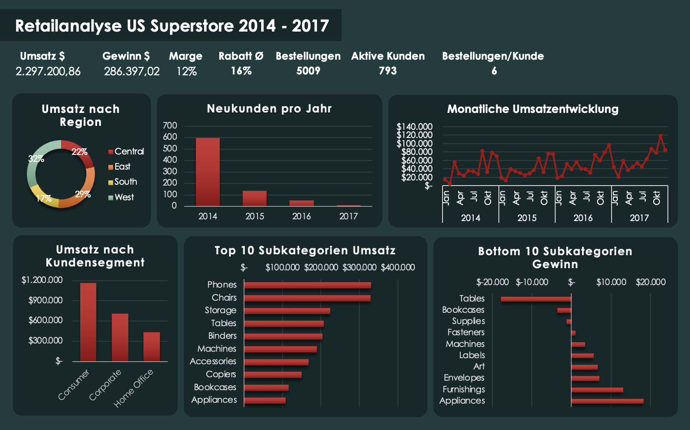
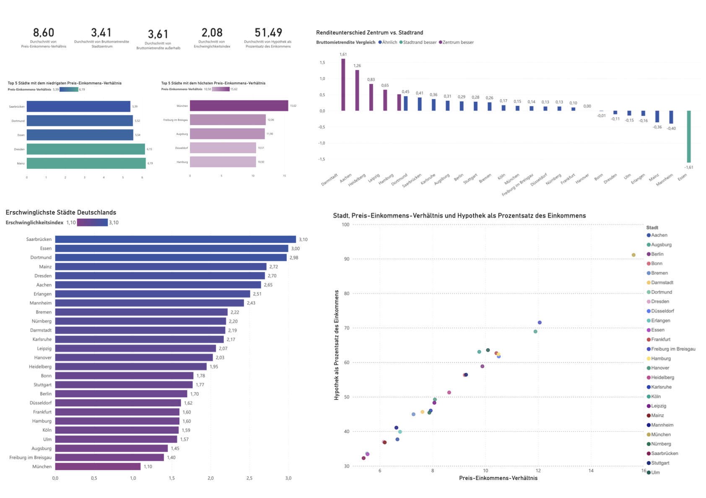
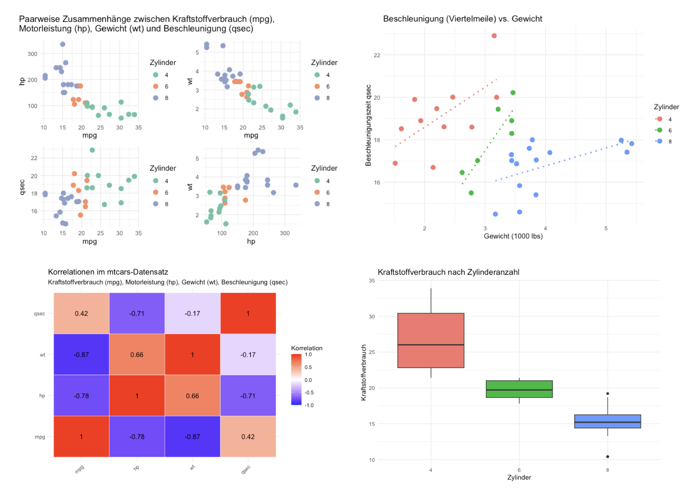
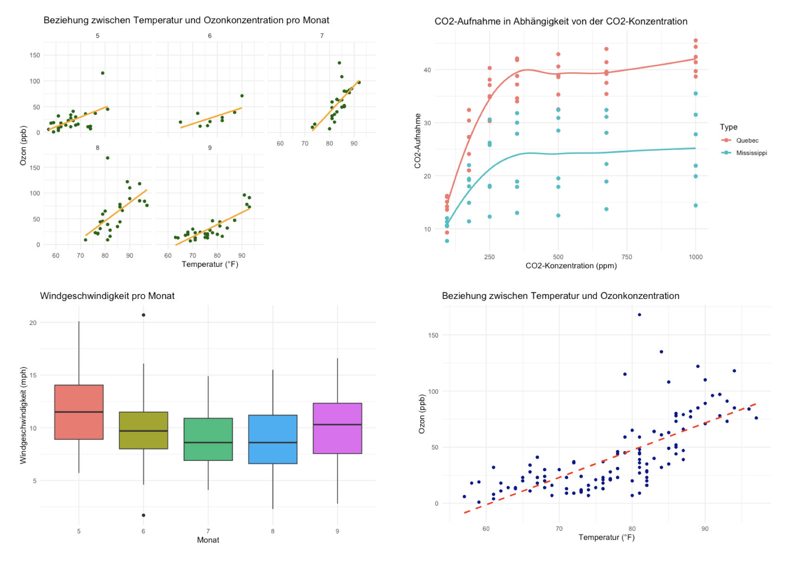
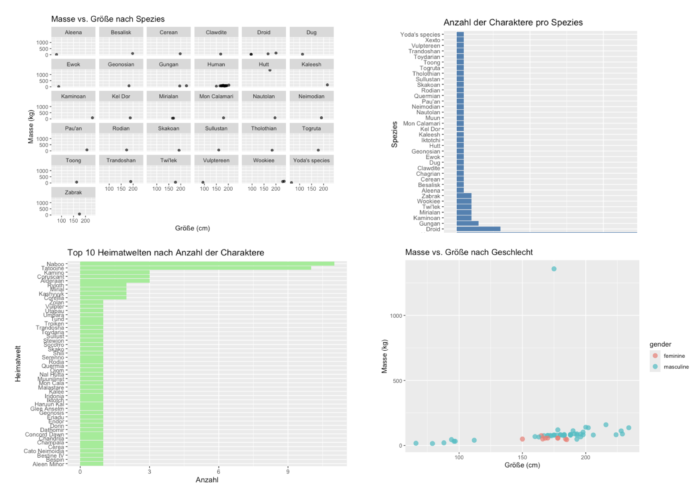
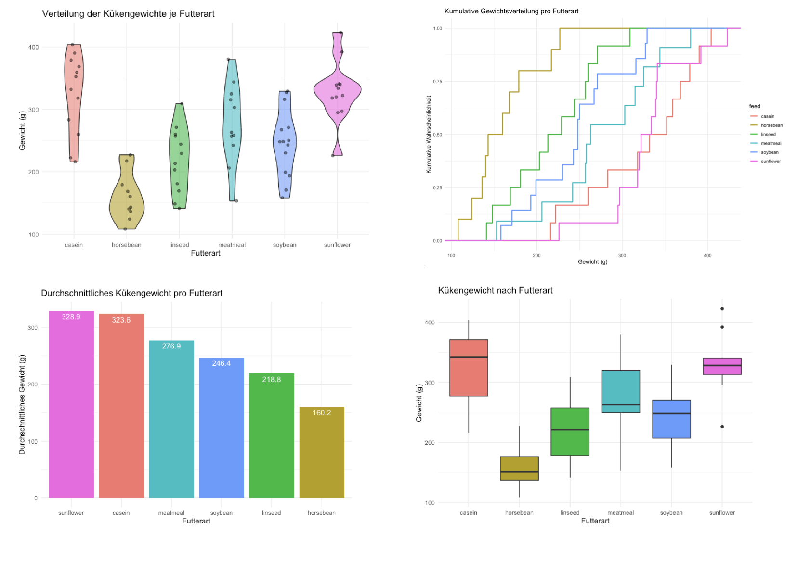
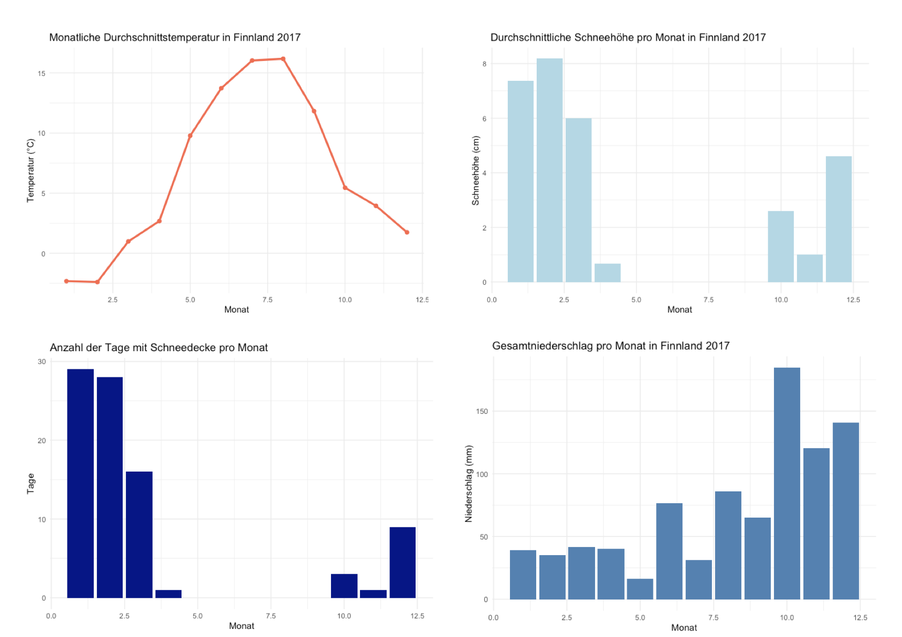
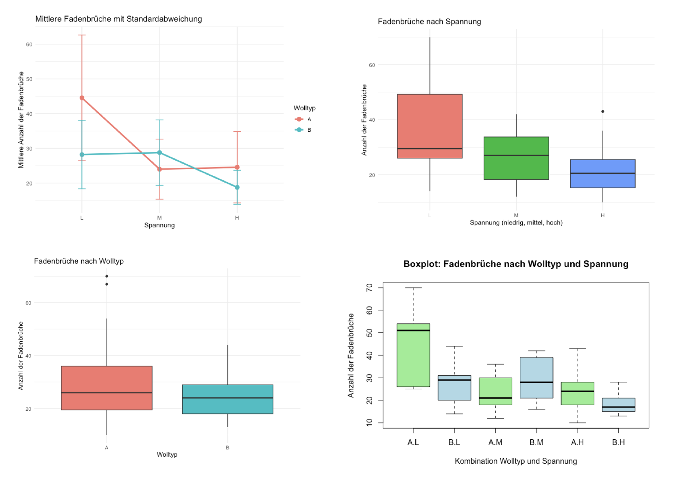

# Data Analytics Portfolio

Willkommen in meinem Data-Analytics-Portfolio.

Ich beschäftige mich mit der Analyse und Aufbereitung von Daten, um belastbare Erkenntnisse zu gewinnen und Entscheidungen zu unterstützen.  
Mein Schwerpunkt liegt auf Dashboard-Entwicklung und explorativer Datenanalyse.

Ich arbeite mit folgenden Tools und Sprachen:
- T-SQL auf Azure SQL Server
- Power BI und Power Query
- R (z. B. tidyverse, ggplot2, Shiny für interaktive Dashboards)
- Python (z. B. pandas, numpy, matplotlib, seaborn)
- Excel

Die Projekte enthalten jeweils kurze Beschreibungen, verwendete Tools sowie ausgewählte Visualisierungen.

---

## Inhaltsverzeichnis

1. [US Superstore Analyse (2014–2017)](#us-superstore-analyse-2014–2017)
2. [Marktanalyse: Immobilienpreise in Deutschland](#marktanalyse-immobilienpreise-in-deutschland)
3. [R Data Portfolio](#r-data-portfolio)
   - [Web Traffic Dashboard (Shiny App)](#web-traffic-dashboard-shiny-app)
   - [Mtcars: Verbrauchs- und Leistungsanalyse](#mtcars-verbrauchs--und-leistungsanalyse)
   - [Airquality & CO2: Umweltdatenanalyse](#airquality--co2-umweltdatenanalyse)
   - [Star Wars Charakteranalyse](#star-wars-charakteranalyse)
   - [Chickwts: Futteranalyse](#chickwts-futteranalyse)
   - [Wetter Finnland 2017](#wetter-finnland-2017)
   - [Warpbreaks: Fadenbruchanalyse](#warpbreaks-fadenbruchanalyse)
   - [R Grundlagen](#r-grundlagen)

---

## US Superstore Analyse (2014–2017)

 

Dieses Projekt analysiert den US-Superstore-Datensatz (2014–2017) mithilfe von T-SQL auf einem Azure SQL Server.  
Ziel ist es, Umsatz, Gewinn, Kundenverhalten, Rabattstrategien, Lieferzeiten und regionale Unterschiede zu untersuchen.

Weitere Inhalte:
- Datenbereinigung
- KPI-Analysen zu Umsatz, Gewinn, Marge, Segmenten, Produkten
- RFM-Analysen
- Zeitreihen zur Umsatz- und Gewinnentwicklung
- Lieferzeiten-Analyse
- Regionale Auswertung

Tools & Technologien:
- Azure SQL Server
- T-SQL
- DBeaver
- GitHub

- [SQL-Skript für die Analyse](SQL/US_Superstore_Analytics.sql)

---

## Marktanalyse: Immobilienpreise in Deutschland

Dieses Projekt analysiert Daten zu Immobilienpreisen, Mietrenditen und Erschwinglichkeit in 26 deutschen Städten.  
Die Analyse wurde in Power BI erstellt und nutzt Power Query zur Datenaufbereitung.

Schwerpunkte:
- Preis-Einkommens-Verhältnisse
- Mietrenditen
- Erschwinglichkeitsklassifizierung
- KPI- und Dashboard-Visualisierungen

Tools & Technologien:
- Power BI
- Power Query
- GitHub

[Power BI Datei](https://github.com/jkschultze/data-analytics-portfolio/blob/main/Power%20BI%20/Marktanalyse%20Immobilienpreise%20in%20Deutschland.pbix)

[Zum Report](https://github.com/jkschultze/data-analytics-portfolio/blob/main/Power%20BI%20/Report%20Marktanalyse%20Immobilienpreise%20in%20Deutschland.pdf)

---

## R Data Portfolio
### Web Traffic Dashboard (Shiny App)

Live-Demo: [Web Traffic Dashboard](https://jkschultze.shinyapps.io/webtrafficdashboard/)

**Beschreibung:** 
Dieses Projekt analysiert Website-Traffic-Daten aus Kaggle. Die interaktive Shiny-App zeigt:

- KPIs nach Segmenten (Clicks, CTR, Bounce Rate, Time Spent)
- Scatterplots (Verweildauer vs. Clicks, Titel-Länge vs. Clicks, Wörter vs. Verweildauer)
- Korrelationen zwischen numerischen Features
- Rohdaten-Tabellen mit Filtermöglichkeiten

**R Script:** [Shiny-App mit vollständiger Analyse](app.R) 

**Projektordner** [README und Originaldatei](WebTrafficDashboards/)

---

### Mtcars: Verbrauchs- und Leistungsanalyse

**Beschreibung:**  
Analyse technischer Fahrzeugkennzahlen wie Motorleistung, Gewicht und Kraftstoffverbrauch bei 32 Automodellen.

**Markdown File:** [verbrauchs-und-leistungsanalyse-mtcars.md](R/verbrauchs-und-leistungsanalyse-mtcars.R)  
**R Script:** [verbrauchs-und-leistungsanalyse-mtcars.R](R/verbrauchs-und-leistungsanalyse-mtcars.R)

**Highlights:**
- Scatterplots und Korrelationsanalyse
- Boxplots nach Zylinderzahl und Getriebe
- Tabellarische Übersichten zu Motorleistung & Verbrauch

---

## Airquality & CO2: Umweltdatenanalyse

**Beschreibung:**  
Untersuchung von Wetterdaten (New York) und CO2-Aufnahmeraten unterschiedlicher Pflanzentypen.

**Markdown File:** [umweltdatenanalyse-airquality-und-co2.md](R/umweltdatenanalyse-airquality-und-co2.md)

**R Script:** [umweltdatenanalyse-airquality-und-co2.R](R/umweltdatenanalyse-airquality-und-co2.R)

**Highlights:**
- Temperatur-Histogramme
- Temperatur vs. Ozon (Scatter + Regression)
- CO2-Aufnahme: Boxplots & Balkendiagramme

---

## Star Wars Charakteranalyse

**Beschreibung:**  
Profilanalyse ikonischer Star-Wars-Charaktere: Größe, Masse, Geschlecht, Spezies, Herkunftsplanet, BMI und mehr.

**Markdown File:** [starwars-charakteranalyse.md](R/starwars-charakteranalyse.md)  
**R Script:** [starwars-charakteranalyse.R](R/starwars-charakteranalyse.R)

**Highlights:**
- Größe-vs-Masse Scatter nach Geschlecht
- Häufigkeit verschiedener Spezies
- BMI-Ranking
- Gruppierungen nach Planet, Spezies, Geschlecht

---

## Chickwts: Futteranalyse

**Beschreibung:**  
Vergleich von Kükengewichten je Futterart zur Untersuchung möglicher Wachstumsunterschiede.

**Markdown File:** [chickwts-futteranalyse.md](R/chickwts-futteranalyse.md)  
**R Script:** [chickwts-futteranalyse.R](R/chickwts-futteranalyse.R)

**Highlights:**
- Boxplots & Violinplots
- Durchschnittsgewicht pro Futterart
- Einfaches lineares Modell

---

## Wetter Finnland 2017

**Beschreibung:**  
Auswertung täglicher Klimadaten in Finnland 2017: Temperatur, Niederschlag, Schneehöhe & Saisonalität.

**Markdown File:** [finnland-wetter-2017-monatsstatistiken-und-trends.md](R/finnland-wetter-2017-monatsstatistiken-und-trends.md)  
**R Script:** [finnland-wetter-2017-monatsstatistiken-und-trends.R](R/finnland-wetter-2017-monatsstatistiken-und-trends.R)

**Highlights:**
- Temperatur-Monatsmittel
- Niederschlag-Summen je Monat
- Schneehöhenanalyse & Extremwerte

---

## Warpbreaks: Fadenbruchanalyse

**Beschreibung:**  
Untersuchung des Bruchverhaltens von Webfäden unter variierenden Spannungen und mit zwei Wolltypen.

**Markdown File:** [warpbreaks-analyse.md](R/warpbreaks-analyse.md)  
**R Script:** [warpbreaks-analyse.R](R/warpbreaks-analyse.R)

**Highlights:**
- Boxplots nach Wolltyp & Spannung
- Lagemaße (Mittelwert, Median, SD)
- Kreuztabellen & Interaktionen

---

## R Grundlagen 
**Beschreibung:**  
Grundlagenübungen zu Datentypen, Datenstrukturen, Kontrollfluss, Funktionen, Statistik, Datenimport & Visualisierung.

**R Script:** [basics.R](R/basics.R)

**Highlights:**
- Arbeiten mit Listen & Dataframes
- Schleifen & Bedingungen
- Statistik-Grundlagen
- Import/Export (CSV, Excel)
- Basis-Plots

---

## Tech-Stack

- T-SQL (Azure SQL Server)
- Power BI
- Power Query
- R (tidyverse, ggplot2, Shiny)
- GitHub
- Markdown
